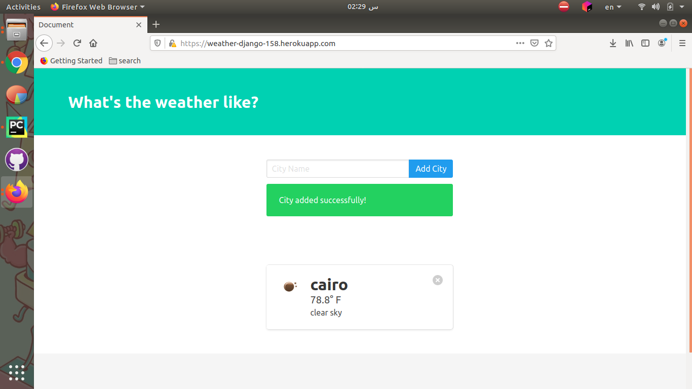
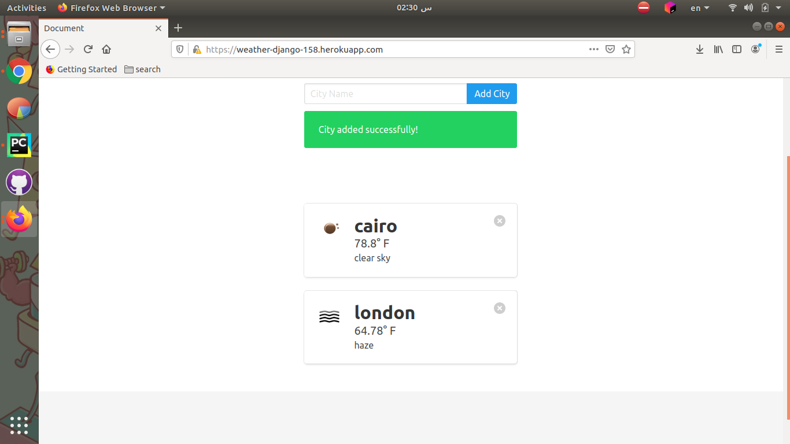
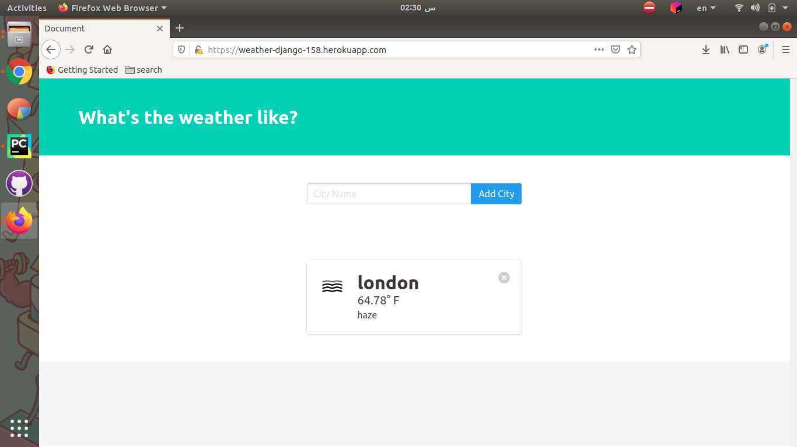

# Weather_Django
get weather for any country using OpenWeatherMap API 

## Installation

get all dependencies

```bash
virtualenv .venv 
source .venv/bin/activate 
cd Weather_Django
python3 manage.py makemigrations 
python3 manage.py migrate
pip3 install -r requirements.txt 
python3 manage.py runserver 
 ```
## Demo

### Hosting URL
https://weather-django-158.herokuapp.com/

### Screenshots






